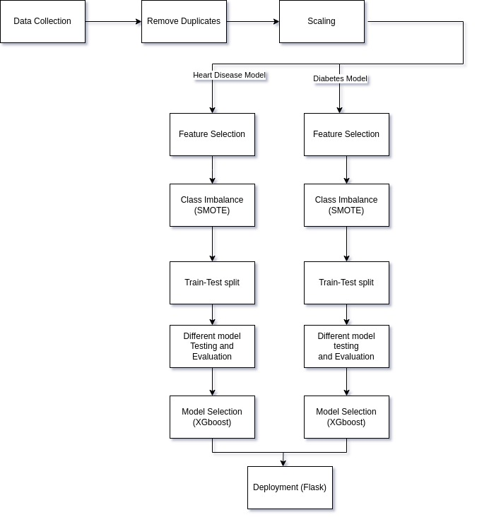

[](LICENSE)
[](https://python.org)
[](https://www.docker.com/)
[](https://mlflow.org/)
[](https://flask.palletsprojects.com/)

# 🩺 Healthcare-DEPI-Project

A full-stack machine learning project developed during the **Digital Egypt Pioneers Initiative (DEPI)**, aims to enhance the early detection of chronic diseases—specifically heart disease and diabetes—through predictive machine learning models.

It also incorporates data visualizations and interactive dashboards to uncover patterns and provide insights into key factors influencing disease risk. By translating health data into actionable insights, the project empowers individuals to take proactive steps toward preventing chronic illnesses.

The project includes data analysis, ML model building, evaluation, and a deployed web interface with integrated MLflow and Docker support.

---

## 🖥️ Web Application

🌐 **Live Website**  
➡️ [Visit the site](https://ahmedmohamady1.github.io/Healthcare-DEPI-Project/index.html)

---

## 👥 Team Members

<table>
  <tr>
    <!-- Row 1 -->
    <td align="center" width="150px">
      <a href="https://github.com/ZizoElkhateeb">
        
        <br />
        <sub><b>Ziad Elkhateeb</b></sub>
      </a>
      <br />
    </td>
    <td align="center" width="150px">
      <a href="https://github.com/AhmedMohamady1">
        
        <br />
        <sub><b>Ahmed Mohamady</b></sub>
      </a>
      <br />
    </td>
    <td align="center" width="150px">
      <a href="https://github.com/VALKAN00">
        
        <br />
        <sub><b>Abdelrahman Ahmed</b></sub>
      </a>
      <br />
    </td>
  </tr>
  <tr>
    <!-- Row 2 -->
    <td align="center" width="150px">
      <a href="https://github.com/YassinAbdelaal">
        
        <br />
        <sub><b>Yassin Abdelaal</b></sub>
      </a>
      <br />
    </td>
    <td align="center" width="150px">
      <a href="https://github.com/Assem118">
        
        <br />
        <sub><b>Assem Deshisha</b></sub>
      </a>
      <br />
    </td>
    <td align="center" width="150px">
      <a href="https://github.com/AhmedMorgan9">
        
        <br />
        <sub><b>Ahmed Morgan</b></sub>
      </a>
      <br />
    </td>
  </tr>
</table>

---

## 📊 Dataset Overview

- **Source:** [Diabetes Health Indicators Dataset - Kaggle](https://www.kaggle.com/datasets/alexteboul/diabetes-health-indicators-dataset)
- **Entries:** ~250,000 individuals
- **Features:** Numeric indicators like BMI, physical activity, smoking, age, blood pressure, and more.
- **Targets:**
  - `Diabetes_binary`: Risk of diabetes (`0` or `1`)
  - `HeartDiseaseorAttack`: Risk of heart disease (`0` or `1`)

---

## 🧠 Project Goals

Build machine learning models that:
- Predict whether a person has **Diabetes** or **Heart Disease**
- Provide high performance (accuracy, precision, recall)
- Deployment:
  - Are accessible through a user-friendly web app and REST API
  - Load models from MLflow Model Registry for production use.
  - Uses local .pkl models, containerized with Docker for testing and portability.

---

## 🚀 Features

- 📊 **EDA and Data Preprocessing**
- 📶 **Dashboard**: Power BI
- 📈 **ML Model Training**: Logistic Regression, Decision Tree, Random Forest, XGBoost  
- 📋 **Model Evaluation**: Accuracy, Precision, Recall, F1-Score  
- 📌 **MLflow Logging**: All runs and metrics are tracked using MLflow  
- 🌐 **Interactive Web Interface** (using HTML, CSS)  
- 🧪 **Flask API**: For local and remote prediction endpoints  
- 🐳 **Dockerization**: Easily run the Flask API in a container

---

## 🛠️ Pipeline


---

## 🛠️ Getting Started

### 📥 Clone the Repository

```bash
git clone https://github.com/AhmedMohamady1/Healthcare-DEPI-Project.git
cd Healthcare-DEPI-Project

```
---

### ▶️ Run Flask API Version1 (MLflow)
1. Install dependencies:
   
```bash
pip install -r requirements.txt
 ```
3. Navigate to the API folder
```bash
cd source
```
5. Run the Flask app:
   
```bash
python app.py
 ```

### 🐳 Run the API Version2 (Docker)
- download Docker folder from github.
1. Make sure you have Docker and Docker Compose installed by using:
```bash
docker --version
docker-compose --version
```
2. Navigate to the project directory.
```bash
cd Docker
```
3. Build and run the containers by using: 
```bash
docker-compose up --build
```
4. Stopping the containers by using:
```bash
docker-compose down
```
